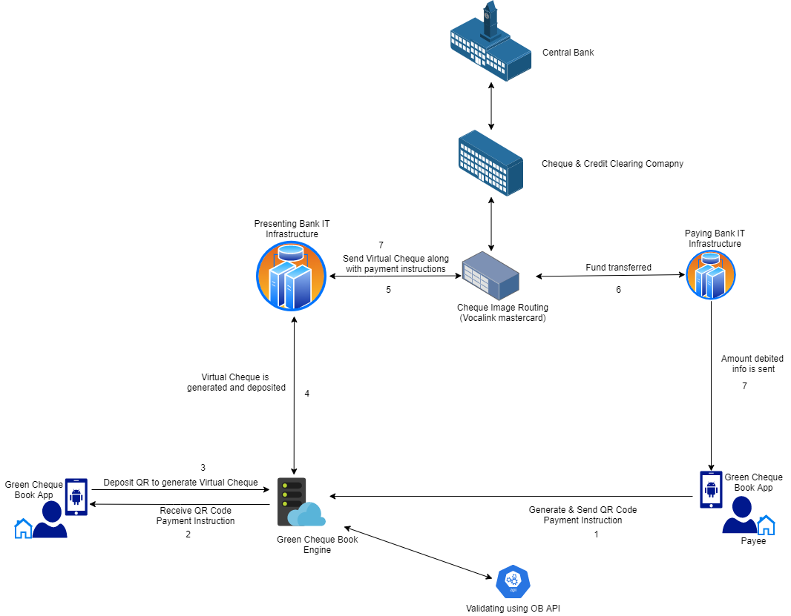

Goal
---
    The Goal of the Project is to transition ourselves from paper Cheque Books to Digital Cheque Books.

    The project main idea is to create QR code containg Payment Instruction instead of paper cheques. 
Thereby eliminating physical activites on depositing cheques in bank/ handing over cheque to concerned parties.
 
 

The Green Cheque Book Engine in the above diagram is Microservice Hosted in Cloud servers.

This Microservice API contains following endpoints
  1) Generate QR Code with payment Instruction
  2) Transfer the QR image from Payee to beneficiary
  3) Read QR Image to render a virtual check which will be placed in the FTPdirectory of Presenting Bank.
  4) Authenticate Users of the Green Cheque APP with its own Database.
  5) Open Banking API to authenticate and validate the Balance information.

The Project Microservice Structure is as follows:

### Modules
For maximum flexibility, the SDK is divided into three modules: Core, Remote and Web. Core and Remote are essential modules if you would like to use SDK to build your own microservice. An example of which is provided in the Web Module.

#### Core
The core module consists of the model structure for AISP and PISP data. The information returned via the APIs are structured into relevant POJOs for ease of access and readability.

#### Remote
The remote module establishes connection with the APIs. It includes construction of headers, configuring security MATLS for sending requests and accepting responses. The requests are actioned upon and connected to internal servers to fetch the required data.

#### Web
The web module acts as an interface connecting the APIs to the Sandbox environment. It houses the controllers of AISP/PISP APIs.

The SDK's default configuration is with Sandbox(in web/resources/application.yml), you don't need to give any credentials or certificates, just run the main class inside web\comm.bankofapis\RestClientApplication directly.
Below are configurable property, in the case you want to use your own.

Changes for Green Cheque APP:
The Web module also contains Microservice end points for following
1) to create QR code
2) to transfer QR Image
3) To submit QR code to generate Virtual Cheque. 
4) Authenticating Green Cheque App Users with its own Database.

## Properties
---

##### Client Properties

| *Property*      |         |
| ------------- |---------|
| id          | The client_id is a public identifier for apps. Even though it’s public, it’s best that it isn’t guessable by third parties, so many implementations use something like a 32-character hex string.       |
| redirectUri |     After a user successfully authorizes an application, the authorization server will redirect the user back to the application with either an authorization code or access token in the URL.    |
| financialId      |       It is the unique identifier of the desired financial institution to interact, assigned by the service bureau where the API is provided by a service bureau which uses the same endpoint for multiple institutions.  |
| state      |      The state parameter preserves some state object set by the client in the Authorization request and makes it available to the client in the response.  |
| authorizationUsername      |    The client is providing its identification to IAM, as username.   |
| authorizationPassword      |    The client is providing the password to IAM.   |
| tokenUrl      |    This is a IAM url to get token for AISP/PISP APIs for a given client.   |

##### TLS Properties

|  *Property* |         |
| ------------- |---------|
| alias      |    A client intending to do mutual TLS (for OAuth client authentication and/or to acquire or use certificate-bound tokens) when making a request directly to the authorization server must use the alias URL of the endpoint within the mtls_endpoint_aliases, when present, in preference to the endpoint URL of the same name at top-level of metadata.      |
| truststore      |   Truststores are repositories of security certificates used for TLS encryption. It contains certificates used to verify certificates received as part of TLS handshaking. Provide the truststore location and password     |
| keystore      |   A Java KeyStore is a repository of security certificates – either authorization certificates or public key certificates – plus corresponding private keys, used for instance in SSL encryption. Provide the keystore location and password.     |

##### AISP Properties

|        |     *Property* |         |
| ------------- | ------------- |---------|
|    Target     | context      |   The authentication context and method used when the end user originally authenticated, and will remain unchanged for the JWT access tokens issued within the context of that session      |
|               | baseUri      |   You can request authorization codes and access tokens by appending only the authorize or token endpoints to the Authentication Base URI.      |
|               | audience      |      The audience of a token is the intended recipient of the token.   |

# SDK example setup for connecting Open Banking API
---
## Preliminary Steps

1. Browse to the RBS sandbox https://developer.rbs.useinfinite.io/
2. Register an account and verify email address to login
3. On the dashboard, click on the pre-created demo app (demo-app-...)
4. Under APIs -> Version 3.1.0 of CMA9 Accounts API, click 'Request Access'...
5. Enable 'Allow security' and 'Allow Tpp' to programmatically authorise User consents'

## How to bootup the application

1.    Clone this repository.
2.    Open IntelliJ, Goto File > New > Project from Existing Resources
3.    Select the cloned Repository > Check Import project from external model and Select Maven
4.    Keep on clicking Next till it detects the pom file and then select Finish. The project would be loaded and displayed on the project pane.
5.    Open terminal in the IDE and run *mvn clean install*, upon completion, right click on the project > Goto Maven > Reimport
6.    Run the main method of *web->RestClientApplication*   

      

>#### *Note*
>- For eclipse, follow maven project setup steps from [here](https://javapapers.com/java/import-maven-project-into-eclipse/).
>- To GET/POST the APIs, download [Postman](https://www.postman.com/downloads/).
>- You have to go in Preferences or Settings > General menu in HEADERS column and make sure that Automatically follow redirects is set to ON

7. Download Postman API collections of "Green Cheque app" from the path :
openbanking-java-sdk-example/postmancollection/GreenCheque APP.postman_collection.json 
  Import the collection in PostMan for running the different API End points used in the project.
  The Request and Respose of each End point is described below.

8. Import Sandbox environment file in POSTMAN from the starter SDK code 

## Dependencies of Microservice

   Added below dependencies in POM file

  <dependency>
        <groupId>com.google.zxing</groupId>
        <artifactId>core</artifactId>
        <version>3.3.0</version>
    </dependency>
    <dependency>
        <groupId>com.google.zxing</groupId>
        <artifactId>javase</artifactId>
        <version>3.3.0</version>
    </dependency>

## GreenCheque APP Demo
---
1. Select environment(sandbox) on the top right in Postman.
2. Run the first *token* and than *AISP Consent Setup* API from GreenCheque APP collection.
http://localhost:8080/open-banking/v3.1/aisp/account-access-consents
----------------------Request Body---------------------
{
	"permission" : ["ReadAccountsBasic", "ReadAccountsDetail", "ReadBalances",
                "ReadBeneficiariesBasic", "ReadBeneficiariesDetail", "ReadDirectDebits",
                "ReadProducts", "ReadStandingOrdersBasic", "ReadStandingOrdersDetail",
                "ReadTransactionsBasic", "ReadTransactionsCredits", "ReadTransactionsDebits",
                "ReadTransactionsDetail"]
}

----------------------Response---------------------
https://api.rbs.useinfinite.io/authorize?client_id=2AO66SW3w0Wespk6Qfx6smSfdDhcdH6KSG1tPEOdBMg=&response_type=code id_token&scope=openid accounts&redirect_uri=http://redirect.acc.com&state=ABC&request=69dea1b8-6723-436b-9611-764e9d386c08

3. Run the *authUrl* in browser. Login using the Customer Number and password. Select account/s and confirm access. Copy the *code* from the redirected url.
>Customer Number : 123456789012, 
 Password : 572436
 
http://redirect.acc.com/#code=0f9365cd-84e7-4efa-aad5-bc148e1a280e&id_token=eyJhbGciOiJQUzI1NiIsInR5cCI6IkpXVCIsImtpZCI6ImpSdzQwV0FFbElyWXVJX2cza1VyYUs5elhTcyJ9.eyJzdWIiOiIyQU82NlNXM3cwV2VzcGs2UWZ4NnNtU2ZkRGhjZEg2S1NHMXRQRU9kQk1nPSIsImFjciI6InVybjpvcGVuYmFua2luZzpwc2QyOnNjYSIsImF1ZCI6IjJBTzY2U1czdzBXZXNwazZRZng2c21TZmREaGNkSDZLU0cxdFBFT2RCTWc9IiwiY19oYXNoIjoiUmtMUkNsNDVOcHdYWmhSYWd3cGdhdyIsIm9wZW5iYW5raW5nX2ludGVudF9pZCI6IjQ1NDk1NTAwLWJmZTItNDgxNS05NmUwLWE4NmMzMjM1ZTljNSIsInNfaGFzaCI6InRkUUVYRDlHYjZrZjRzeHF2bmtqS2ciLCJpc3MiOiJyYnMudXNlaW5maW5pdGUuaW8iLCJleHAiOjE2MTI4NTI2NDgsInRva2VuX3R5cGUiOiJJRF9UT0tFTiIsImlhdCI6MTU4MTMxNjY0OCwianRpIjoiNzJhNzM0NWQtYmNiOS00ZDgwLWJmMGEtODFhNGU4ZWNjZTFhIn0.qrW82h_2vazetkc06XvgJvAtle1Iqi2DcygRkdB_RU732bBHspV1jxj7_bW9vjSzadTUZ_33ugRaxblux-s_yNk-dZr78J2VsxfYlThTC7pqaKRBZYw1fRvbuOC7hKsF6IX0SESIyJ-oz1Okj1lgFJdiumM8JupsovyywSzlCna8p7fvmf4uv75lPH7vS1MYgEfpH-8UM_3q8KAV66j-OlyLKPxV5omvHfe783zzMoAmc6sAFpwY9EHlb5rfjcv8gwSQA5qBagjIBENjwVRa3BparZkro40Y3nsMFxpQCTtXB5o4u8vczp8QG02BpbrDDKwdfry5AlvBUnn5pmIK1w&state=ABC 

4. Pass the *code* to the OBToken API. This will generate the Access and refresh tokens.
5. To get the Account information for a single id. Run the AccountId API, with the account id in path param.

----------------------Request---------------------
http://localhost:8080/open-banking/v3.1/aisp/accounts/***Append Id Here***

----------------------Response Body---------------------
{
    "Data": {
        "Account": [
            {
                "AccountId": ***Account Id***,
                "Currency": "GBP",
                "AccountType": "Personal",
                "AccountSubType": "CurrentAccount",
                "Description": "Personal",
                "Nickname": "Debit Account - RBS - Sydney",
                "Account": [
                    {
                        "SchemeName": "UK.OBIE.SortCodeAccountNumber",
                        "Identification": ***Identification Value***,
                        "Name": "Debit Account - RBS - Sydney"
                    }
                ]
            }
        ]
    },
    "Links": {
        "Self": "https://ob.rbs.useinfinite.io/open-banking/v3.1/aisp/accounts/***Account Id***"
    },
    "Meta": {
        "TotalPages": 1
    }
} 
6. Similarly you can get Account List, Balances by Id, Direct Debits, Standing Orders, Transaction Lists and Products by Id.

13.QRgenerate:

Request:
POST:http://localhost:8080/open-banking/v3/cheques/QRCheque

Body:
{
"payeeName":"Deva",
"payeeAcNum":"1234567890",
"payeeSortCode":"123456",
"beneName":"Kamaraj",
"brand":"RBS",
"beneAcNum":"9876543211",
"acPayOnly":true,
"beneSortCode":"654321",
"chequeAmount":5
}

Response:

<<QR IMAGE>>
<<Payment Instruction>>

14.submit QRcheque and generate VitrualCheque:

Request:
GET:http://localhost:8080/open-banking/v3/cheques/submitQR/?qrImage=Kamaraj794108007-QRCode.png&folder=receieved/Kamaraj&user=Kamaraj

Response:
Processed Successfully 

Note: QR Code is read and Payment Instruction are created.

15. Share the QRchecque

Request:
GET:http://localhost:8080/open-banking/v3/cheques/shareQR/?qrImage=Kamaraj794108007-QRCode.png&user=Deva&bene=Kamaraj

Resposnse:
"Shared to Beneficiary"

Note: QR image is moved from payee accessible folder to Beneficiary accessible folder

16. getAllReciever QRcheque by username

Request:
GET:http://localhost:8080/open/banking/v3/cheques/getAllReceived/?user=Naveen

Response:

{
    "QrCheques Recieved": "[src\\main\\resources\\qrimages\\receieved\\Naveen\\Naveen20178358-QRCode.png, src\\main\\resources\\qrimages\\receieved\\Naveen\\Naveen32910615-QRCode.png, src\\main\\resources\\qrimages\\receieved\\Naveen\\Naveen9088589-QRCode.png, src\\main\\resources\\qrimages\\receieved\\Naveen\\Naveen9384610-QRCode.png]"
}

17. getAll generated pending QRcheque by username

Request:
GET: http://localhost:8080/open-banking/v3/cheques/getAllGenerated/?user=Sudha

Response:

{
    "QrCheques Pending": "[src\\main\\resources\\qrimages\\generated\\Sudha\\aaru30622290.txt, src\\main\\resources\\qrimages\\generated\\Sudha\\Naveen20178358.txt, src\\main\\resources\\qrimages\\generated\\Sudha\\Naveen32910615.txt, src\\main\\resources\\qrimages\\generated\\Sudha\\Naveen9088589.txt, src\\main\\resources\\qrimages\\generated\\Sudha\\Naveen9384610.txt, src\\main\\resources\\qrimages\\generated\\Sudha\\NaveenMani24828346.txt, src\\main\\resources\\qrimages\\generated\\Sudha\\vel15630401.txt]"
}

18. LoginAuthenticate

Request:
POST:http://localhost:8080/open-banking/v3/cheques/authenticate

Body:
{  
   "email": "Naveen@gmail.com",  
   "password": "Develope"  
 }

Response:

0

19. LoginSearchByEmail

Request:
POST: http://localhost:8080/open-banking/v3/cheques/personel/email

Body:
{  
   "email": "Naveen@gmail.com",  
 }

Response:
{
    "id": "6a0afa22-3097-485c-8681-8906f32f5923",
    "email": "Naveen@gmail.com",
    "password": "**********",
    "accountno": "7891011"
}